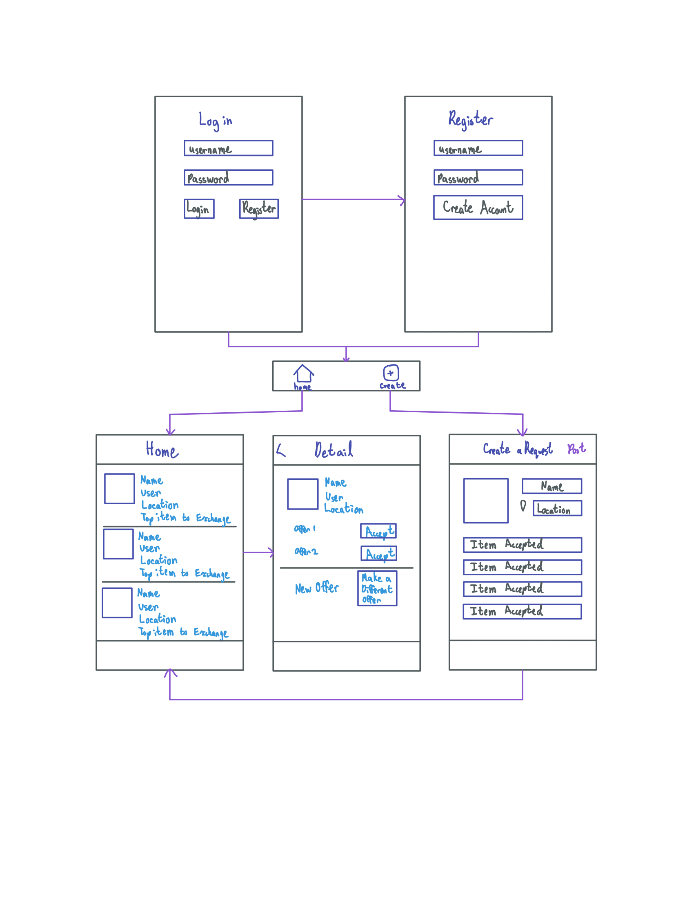

# Snack Exchange

## Table of Contents
1. [Overview](#Overview)
1. [Product Spec](#Product-Spec)
1. [Wireframes](#Wireframes)
2. [Schema](#Schema)

## Overview
### Description
Go out into your community and exchange snacks with Snack Exchange. If you have way too many of one snack, find a snack you crave and switch with a local. Never fear buying snacks in bulk again.

### App Evaluation
- **Category:** Shopping
- **Mobile:** Snack Exchange will allow you to use your location to arrange and reach the trade spot for the snacks. You may also use your phone's camera to take a picture of the snack you wish to exchange easily.
- **Story:** Allows users to satisfy their snack cravings while using snacks they do not like or do not enjoy as much. 
- **Market:** Anyone that enjoys snacking could enjoy this app. Ability to search for snacks by categories allows users to find new snacks they may enjoy.
- **Habit:** Users can search and post snacks at any point in the day. Searching by category encourages people to use this app to find new snacks
- **Scope:** While this app will be very technically challenging, it has room to grow. It will start by including the ability to post snacks and view recently posted snacks. Then, it will progress to include the searching for snacks. 

## Product Spec

### 1. User Stories (Required and Optional)

**Required Must-have Stories**

* User can login
* User can register a new account
* User can view snacks that are up for exchange
* User can create a snack request
* User can agree to a posted exchange

**Optional Nice-to-have Stories**

* User can view snack requests they have made
* User can search for snacks
* User can leave a review on another user
* User can use location to search for trade spots
* User can chat with other users to make offers

### 2. Screen Archetypes

* Login
    * User can login
* Register
    * User can register a new account
* Stream
    * User can view snacks that are up for exchange
* Detail
    * User can agree to a posted exchange
* Creation
    * User can create a snack request

### 3. Navigation

**Tab Navigation** (Tab to Screen)

* Stream
* Creation

**Flow Navigation** (Screen to Screen)

* Login
    * Register
    * Stream
* Register
    * Stream
* Stream
    * Detail
* Detail
    * None
* Creation
    * Stream

## Wireframes



## Schema 

### Models
#### Request

   | Property      | Type     | Description |
   | ------------- | -------- | ------------|
   | objectId      | String   | unique id for the user request (default field) |
   | author        | Pointer to User| author of request |
   | location      | String   | location request will be based off |
   | image         | File     | image of user's snack |
   | itemSelling   | String   | snack user wants to exchange |
   | itemRequest   | Array    | snacks user is willing to accept |
   | requestStatus | String   | indicates if request is active, in progress, or sold |
   | createdAt     | DateTime | date when request is created (default field) |
   | updatedAt     | DateTime | date when request is last updated (default field) |
   
 #### User

   | Property      | Type     | Description |
   | ------------- | -------- | ------------|
   | objectId      | String   | unique id for the user request (default field) |
   | username      | String   | the username for the user |
   | password      | String   | the password for the user |
   | createdAt     | DateTime | date when request is created (default field) |
   | updatedAt     | DateTime | date when request is last updated (default field) |
   
### Networking
- Register Screen
  - (Create/POST) Create a new user object
  ``` objc
   PFUser *newUser = [PFUser user];
    
    // set user properties
    newUser.username = self.usernameField.text;
    newUser.password = self.passwordField.text;
    
    // call sign up function on the object
    [newUser signUpInBackgroundWithBlock:^(BOOL succeeded, NSError * error) {
        if (error != nil) {
            NSLog(@"Error: %@", error.localizedDescription);
        } else {
            NSLog(@"User registered successfully");
            
            // TODO: segue to home view
        }
    }];
    ```
- Home Feed Screen
  - (Read/GET) Query all requests
  ``` objc
  PFQuery *query = [PFQuery queryWithClassName:@"Request"];
  [query orderByDescending:@"createdAt"];
  [query includeKey:@"author"];
  
  // fetch data asynchronously
  [query findObjectsInBackgroundWithBlock:^(NSArray *requests, NSError *error) {
    if (requests != nil) {
        // TODO: do something with requests
    } else {
        NSLog(@"%@", error.localizedDescription);
    }
  }];
  ```
- Details Screen
  - (Update/PUT) Update request status
  ``` objc
  PFQuery *query = [PFQuery queryWithClassName:@"Request"];
  // TODO: obtain request's object id
  // Retrieve the object by id
  [query getObjectInBackgroundWithId:requestID
                             block:^(PFObject *request, NSError *error) {
    request[@"requestStatus"] = @"in progress";
    [request saveInBackground];
  }];
  ```
- Create Post Screen
  - (Create/POST) Create a new request object
  ``` objc
  // TODO: get correct property values
  PFObject *request = [[PFObject alloc] initWithClassName:@"Request"];
  request[@"author"] = [PFUser currentUser];
  request[@"location"] = location;
  request[@"image"] = imageFile;
  request[@"itemSelling"] = itemSelling;
  request[@"itemRequest"] = itemRequest;
  request[@"requestStatus"] = @"active";
  [request saveInBackground];
  ```
  
  
